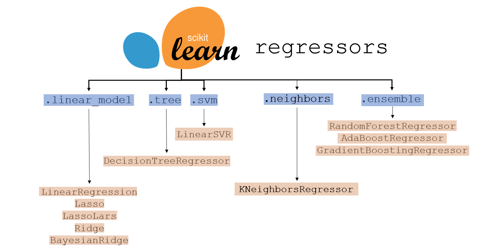
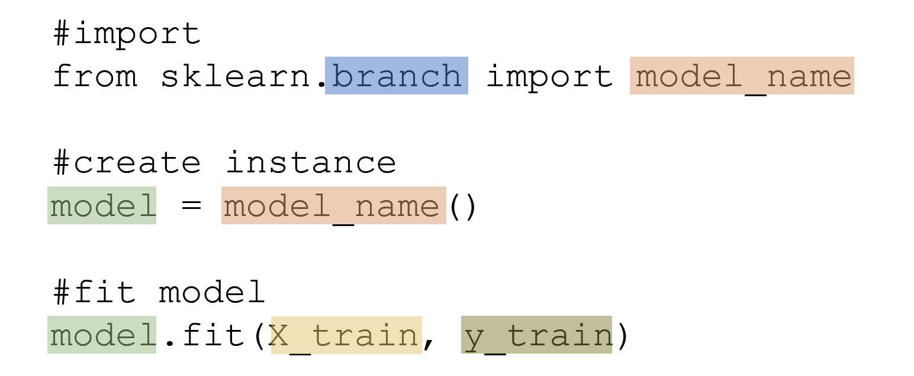
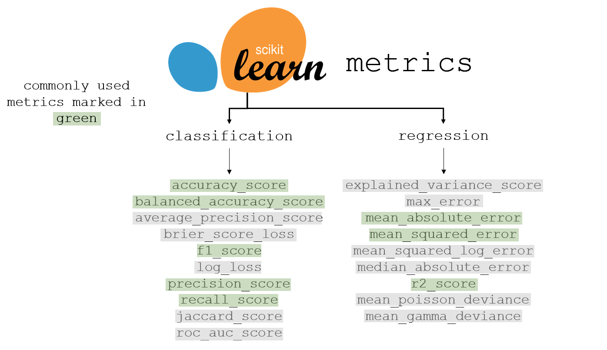

# Machine Learning Algorithms
Machine Learning with Scikit Learn

<table align='center'>
  <tr><th><h3>Split the Dataset into Train Set and Test Set</h3></th></tr>
  <tr><td></td></tr>
  <tr><th><h3>Scikit Learn Models for Regression</h3></th></tr>
  <tr><td></td></tr>
  <tr><th><h3>Scikit Learn Models for Classification</h3></th></tr>
  <tr><td></td></tr>
  <tr><th><h3>Initialize and Train Model</h3></th></tr>
  <tr><td></td></tr>
  <tr><th><h3>Scikit Learn Metrics for Regression and Classification</h3></th></tr>
  <tr><td></td></tr>
  <tr><th><h3>Performance of Model</h3></th></tr>
  <tr><td></td></tr>
</table>
